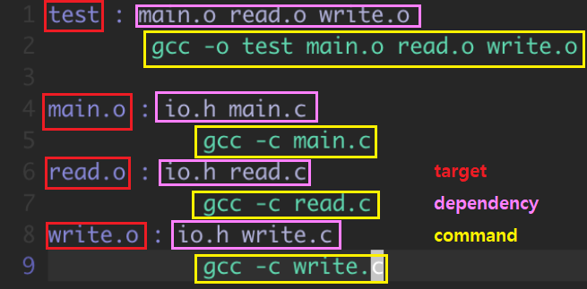
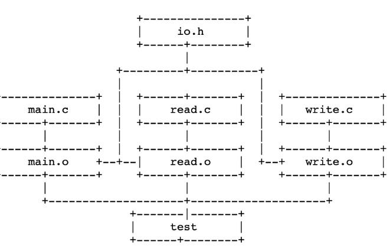
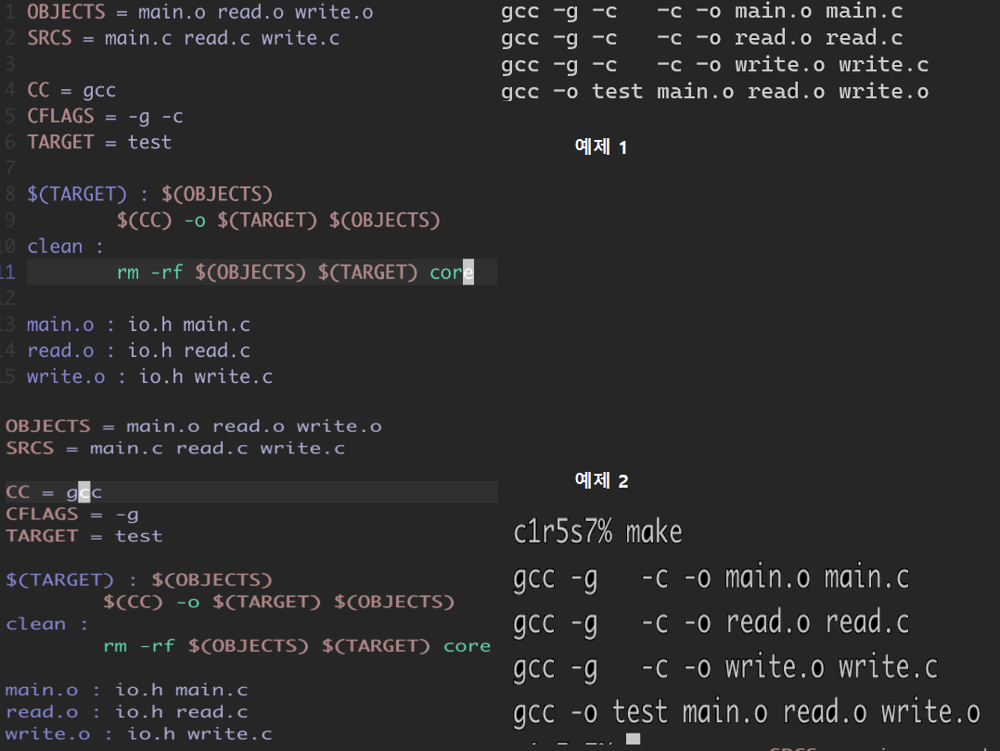
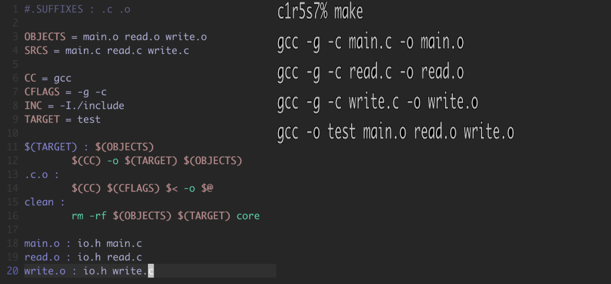
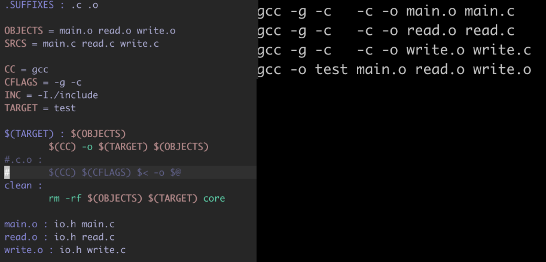

# 00. Makefile 정리
* Last Update : 20.07.10

# index
1. [선수 지식](#1.-선수-지식)
    - [빌드 과정과 관련된 용어](#빌드-과정과-관련된-용어)
    - [make와 관련된 개념](#make와-관련된-개념)
    - [Makefile 사용 이유](#Makefile-사용-이유)
    - [gcc 컴파일 옵션](#gcc-컴파일-옵션)
2. [Makefile 실습](#Makefile-실습)
    - [Makefile의 기본 구조](#Makefile의-기본-구조)
    - [예제 1: Makefile의 기본 구조](#예제-1:-Makefile의-기본-구조)
    - [예제 2: Macro 사용하기](#예제-2:-Macro-사용하기)
        - [Macro의 개념](#Macro의-개념)
        - [Pre-defined Macro](#Pre-defined-Macro)
    - [확장자 규칙](#확장자-규칙)
        - [SUFFIXES를 이용한 예제](#SUFFIXES를-이용한-예제)
        - [내부 매크로](#내부-매크로)

## 1. 선수 지식
>`Makefile`은 프로그램 빌드와 관계 있는 도구다. 따라서 `Makefile`을 알기 전에 간단하게나마 알아야 할 개념이 몇 가지 있었기에 정리하였다.

### 빌드 과정과 관련된 용어
1. 오브젝트 파일: 오브젝트 (object) 파일은 저수준의 명령어와 정적 데이터가 기록된 바이너리 파일을 말한다. 
    - 오브젝트 파일을 운영체제가 실행시키기 위해선 cpu나 memory 등 물리적 자원이 필요하다,
2. 링킹 : 여러 개의 코드와 데이터를 모아서 한 개의 실행파일로 만드는 작업이다.
    - 각 소스 파일(*.c)는 오브젝트 파일(*.o)로 변환되고, 여러 오브젝트 파일은 하나의 오브젝트 파일로 묶이는데, 이를 Linker라 하며, 이 파일은 executalbe file이다.
    - 링킹 시 소스파일은 서로 의존 관계에 있는 binary에 따라 묶인다.
    - 동적 링킹은 runtime 때 의존관계를 로드한다.
    - 정적 링킹은 compile time 때 의존관계가 로드한다. (ex: *.h파일)
    - executable file을 실행하면, 운영체제는 메모리에 프로그램을 올리고 프로그램의 프로세스에 따라 동작이 수행된다.
3. 빌드는 링킹이나 컴파일보다 큰 범위로, 소스코드가 실행가능한 것으로 만들어지는 일련의 과정을 말한다.
4. 의존 관계 dependency
- 어떤 파일이 외부의 헤더나 함수를 이용해서 짜여졌다면, 이 함수가 제대로 컴파일 되기 위해선 컴파일 시 외부 헤더나 함수가 필요하다.
- 이렇듯 어떤 파일이 컴파일 되기 위해 어떤 특정 파일을 필요로 하는 것을 ‘의존한다’고 표현하며, 양자의 관계를 의존관계라 한다.

### make와 관련된 개념
1. `make`란, 리눅스에서 프로그램을 빌드할 때 주로 쓰는 자동화 도구이다. `make`엔 `make` 전용 표준 문법이 있는데, 그 문법으로 빌드 과정을 서술할 수가 있고, 이것이 적힌 파일이 `Makefile`이다.
2. 작업 디렉토리에 `Makefile` 스크립트를 저장해두면 `make`로 자동으로 빌드 작업을 수행시킬 수 있다.

### Makefile을 사용 이유
* 프로그램 갱신 시, 전체를 다시 컴파일하는 것이 아니라 갱신된 것만 새롭게 반영하기 위해 사용한다.
* 대량의 파일일 경우, 의존관계를 한번에 파악하기 어렵다. 따라서 작은 수정으로도 모든 파일을 컴파일해야 한다면 많은 시간적 부담이 따른다. 이럴 때 `makefile`은 작업을 효율적으로 할 수 있도록 도와준다.

### gcc 컴파일 옵션
* `gcc -c`: `.o` 파일 생성
* `gcc -o 이름`: 지정한 이름으로 결과파일이 만들어진다.
#### makefile 활용
* `gcc -o $(target) $(object)`: 실행파일 만드는 또 다른 방법.

## Makefile 실습
> 일러두기: 테스트 파일은 테스트 용도기에 빈 파일로 작성하였다. 다만, `main.c`만 `printf`을 이용하여 간단하게 작성하였다.

### Makefile의 기본 구조
* 
* 목표 target: 명령이 수행되어서 나온 결과 파일을 말한다. 보통 오브젝트 파일이나 실행 파일이 된다.
    - 목표 부분엔 결과 파일만 올 수 있는 것은 아니고, `make clean`과 같이 간단한 레이블 (label) 기능을 제공하기도 한다.
    - `:` 콜론으로 구분한다.
* 의존 관계 dependency: target을 만들기 위한 자료
* 명령 command: 의존관계 부분에 정의된 파일의 내용이 바뀌거나, 목표에 해당하는 파일이 없을 때 차례대로 실행된다.
    - 명령은 기본적으로 `Shell` 명령어를 지원한다.
    - 명령은 꼭 tab으로 시작해야 하고, 그렇지 않으면 에러가 발생한다.
        - 이는 `Makefile`이 `tab`으로 명령을 구분하기 떄문이다

### 예제 1: Makefile의 기본 구조

* 
* 예제 1의 의존관계
    - `test`가 만들어지기 위해선 `*.o` 파일들이 필요하고, `*.o` 파일들은 각 `*.c`파일과 `io.h` 파일에 의존한다.
    - 이에 `main.c`를 고쳤다면 `main.o`가 컴파일 되어 다시 생기고, `test`도 다시 링크되어 새롭게 생긴다.
    - `io.h`가 고쳐졌을 경우, 모든 파일이 다시 컴파일 되어 다시 목적파일을 생성하고, 그것들이 링크되어 `test`가 생긴다.
    - `main.c`를 고친 후 `make`를 했더니 `main.c`가 다시 컴파일 되었고, `test`도 다시 링킹되어 만들어졌다.

* 

### 예제 2: Macro 사용하기
#### Macro의 개념
* Macro: 값을 대입하는 용도, 마치 변수와 같다.
    - ex : `OBJECTS = main.o read.o write.o`
    - `OBJECTS`에 `main.o`, `read.o`, `write.o`가 담긴다.
* 즉, 매크로는 특정한 코드를 간단하게 표현한 것이다.
* 매크로 선언 위치
    - 목표 부분에 해당하는 곳에 선언해줄 수 있고, 레이블처럼 사용할 수도 있다.
    - 예시
                clean : 
                    rm $(OBJECTS)
* 선언한 Macro는 환경변수처럼 사용하면 된다. 사용할 땐 `${}`, `$()`, `$`을 사용할 수 있지만, 대부분 `$()`을 사용함. 

#### Pre-defined Macro
* `Makefile` 시스템에서 미리 정해진 규칙을 수행하는 macro가 있다.
* 그러나 대부분 사용자의 편의에 맞춰 직접 다시 설정해주는 경우가 많다. 
* 자세한 종류는 [implicit rules](https://docs.oracle.com/cd/E19504-01/802-5880/make-36/index.html) 등을 참고할 것.
* `cc` 는 `gcc`, `CFLAGS`는 `gcc`의 플래그를 쓸 때 사용하는 관습이 있음.
    - `CFLAGS` 사용 시 `gcc`의 `-c` 플래그가 자동으로 추가됨.
##### Pre-defined Macro 예제
* 
* 예제 1에선 `main.o`는 `io.h`와 `main.c` 에 의존관계를 갖고, 명령어를 통해 `gcc -c main.c`를 실행시켜 `.c`를 `.o`로 바꾸는 과정을 거쳤다.
* 예제 2에선 `CFLAGS` 매크로를 사용해줌으로, `CFLAGS`에 `-c`를 제거했지만 `make` 내부에서 이용되어 알아서 해준 것이다.
* 참고: `.o` 파일이 어디에 의존하는지는 명확히 밝혀주는 것이 좋다.

#### 확장자 규칙

* `.c.o`는 `.c`, `.o` 확장자를 자동으로 인식해서 필요한 작업을 수행하도록 한다.
    - ex) 
                .c.o : 
                    $(CC) $(CFLAGS) -c $< -o $@ 
    - `.c`, `.o` 확장자를 가진 파일에 대해 명령을 실행함.
##### SUFFIXES를 이용한 예제
* `.SUFFIXES`: `make` 파일에게 주의 깊게 처리할 파일들의 확장자를 등록해주는 역할을 한다.
    * 확장자 규칙에 의해 `make`는 파일들의 확장자를 자동으로 인식해서 필요한 작업을 수행한다.
* 이는 `.c.o` 규칙이 `$(CC) $(CFLAGS) -c $< -o $@`를 자동으로 동작하는 것과 같다.
* 즉, `Makefile` 내부의 `CFLAGS` 등을 인식하여, 필요한 동작을 알아서 하는 것이다.

* 1. `.c.o` 가 있을 때. `(SUFFIXES)`가 없을 때
    - 
* 2. `.c.o`가 없고 `(SUFFIXES)`가 있을 때
    - 

##### 내부 매크로
* `$*`: 확장자가 없는 현재의 목표 파일 (Target)
* `$@`: 현재의 목표 파일
* `$<` : 현재의 목표파일보다 더 최근에 갱신된 파일 이름
* `$?` : 위와 차이는 있으나 거의 같음.

##### [상단으로](#00.-Makefile-정리)