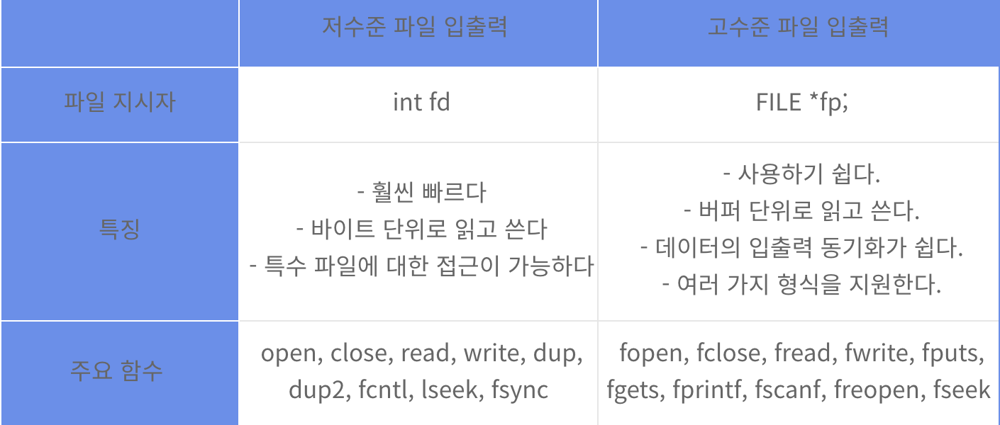
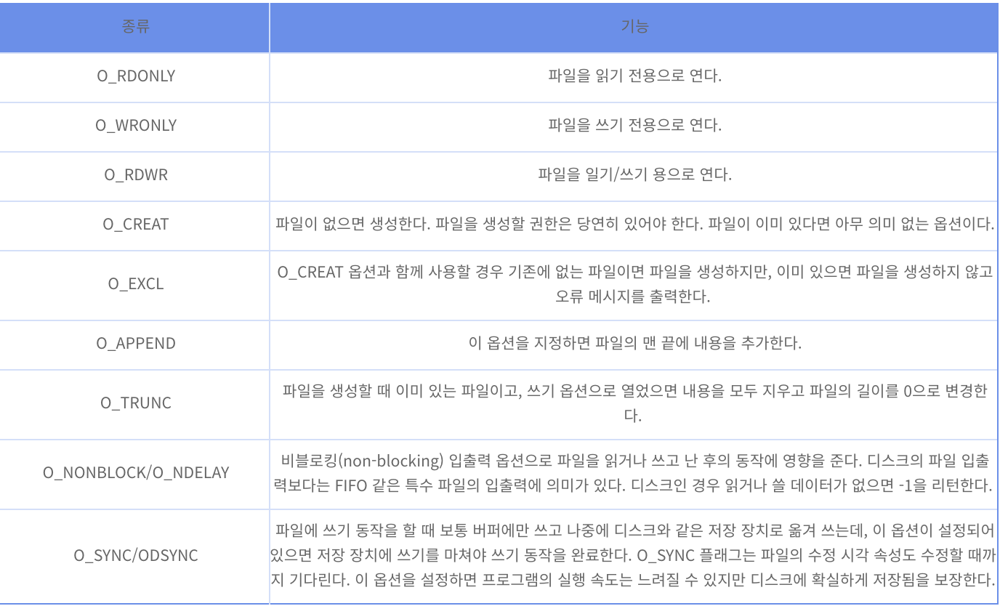

# 01. Low level File IO
* Last Update : 20.07.11

# index
0. [들어가며](#0-들어가며)
1. [파일 입출력의 정의와 분류](#1-파일-입출력의-정의와-분류)
    - [파일 입출력의 정의](#파일-입출력의-정의)
2. [저수준 파일 입출력](#2-저수준-파일-입출력)
    - [파일 기술자 file descriptor](#파일-기술자-file-descriptor)
    - [파일 열기, 생성, 닫기](#파일-열기-생성-닫기)
    - [파일 읽기와 쓰기](#파일-읽기와-쓰기)

## 0. 들어가며
* 서로 관련 있는 데이터의 집합인 파일은, 하드 디스크 등 저장 장치에 일정한 형태로 저장된다. 파일은 데이터 저장, 전송, 장치 접근에도 사용된다.
* 유닉스에선 이러한 파일에 접근할 수 있는 것은 물론, 데이터를 입력하거나 파일의 데이터를 출력할 수 있다.
* 본 글에선 이와 같은 '파일 입출력 부분'에 대해 다루며, 그 중에서도 Low level 한다.

## 1. 파일 입출력의 정의와 분류
### 파일 입출력의 정의
* 파일 입출력: 파일을 읽고 쓰는 것을 말하며 크게 저수준 파일 입출력과 고수준 파일 입출력으로 구분된다. 
* 저수준 파일 입출력: 저수준 파일 입출력은 유닉스 커널의 시스템을 호출하여 파일 입출력을 수행하는 것을 말한다.
    - 저수준 파일 입출력은 시스템 호출(System call)을 이용하므로 파일에 좀 더 빠르게 접근할 수 있다는 장점이 있다. 
    - 또한 저수준 파일 입출력은 __바이트 단위__ 로 파일의 내용을 다루므로, 일반 파일뿐만 아니라 특수 파일도 읽고 쓸 수 있다.
    - 하지만 바이트 단위로만 입출력을 수행하므로, 이를 이용해서 응용 프로그램을 작성하려면 바이트를 적당한 형태의 데이터로 변환하는 함수 등 여러 가지 추가적인 기능을 구현해야 하는 단점이 있다.
* 고수준 파일 입출력: 저수준 파일 입출력의 불편함을 해결하기 위해 제공된다.
    - 고수준 파일 입출력은 C 언어의 표준 함수로 제공된다.
    - 데이터를 바이트 단위로 한정하지 않고 버퍼를 이용해 한꺼번에 읽기/쓰기를 수행한다.
    - 또한 다양한 입출력 데이터 변환 기능도 이미 구현되어 있어 데이터형에 따라 편리하게 이용할 수 있다. 고수준 파일 입출력을 표준 입출력 라이브러리라고도 한다.
#### 저수준 파일 입출력과 고수준 파일 입출력의 주된 차이

* __저수준 파일 입출력__ 은 열린 파일을 참조하는 데 __파일 기술자(file descriptor)__ 를 사용하는 반면, __고수준 파일 입출력__ 은 __파일 포인터(FILE pointer__ 를 사용한다. __파일 포인터__ 는 열린 파일의 특성에 관한 정보를 저장하는 구조체를 가리키는 포인터이다. 이 파일 포인터 구조체의 항목 중 하나가 파일 기술자다.

* 저수준 파일 입출력과 고수준 파일 입출력을 비교하면 위 그림과 같다. 주요 함수를 보면 `open`, `close`, `read`, `write` 등 비슷한 함수명이 있다. 실제로 데이터를 읽고 쓰는 함수는 저수준 파일 입출력의 경우 `read`, `write` 뿐이지만, 고수준 파일 입출력은 `fread`, `fwrite`, `fgets`, `fputs`, `fprintf`, `fscanf` 등 다양한 함수가 있다. 고수준 파일 입출력이 사용자의 편의를 고려하고 있음을 알 수 있다.

## 2. 저수준 파일 입출력
### 파일 기술자 file descriptor
#### 파일 기술자의 정의
* 파일 기술자: 현재 열려있는 파일을 구분할 목적으로 유닉스가 붙여놓은 번호를 말한다.
    - 열려있는파일을 참조하는 데 사용하는 지시자 역할을 한다.
    - 정수값이며, `open` 함수를 사용해 파일을 열었을 때 부여된다.
#### 파일 기술자의 규칙
* 파일 기술자는 0번부터 시작한다.
* 번호 별 규칙
    - `0`: 표준 입력 => 키보드
    - `1`: 표준 출력 => 모니터 화면
    - `2`: 표준 오류 출력 => 모니터 화면
* `0`, `1`, `2` 파일 기술자를 다른 파일에 지정할 수도 있다.

#### 프로세스와 파일 기술자의 관계
* [참고 링크](http://blog.naver.com/ryangjm/10170724995)
* Linux의 각 계정마다 하나의 프로세스가 가질 수 있는 파일 기술자의 개수엔 제한이 있다.
* 제한(limit)엔 soft limit, hard limit이 있다.
    - soft limit : 새로운 프로그램이 생성될 때 default로 적용되는 값. : 1024
    - hard limit: soft로부터 늘릴 수 있는 최대 값. : 2048
* 프로세스가 처음 동작 시 `0`, `1`, `2`는 기본적으로 할당된다. 
* 파일 기술자는 낮은 번호부터 할당된다.
    - 이에 보통 파일 기술자는 `3`부터 할당된다.
    - 물론 `0`, `1`, `2` 중 닫아놓았는지의 여부에 따라 처음 할당되는 번호는 달라질 수 있다.
[file descriptor](./srcs/01/images/01.png)

### 파일 열기, 생성, 닫기
* 파일을 사용하기 위해선 먼저 열어야 한다.
* 파일을 연다는 것은 파일의 내용을 읽거나 파일에 내용을 쓸 수 있는 상태로 변경하는 일을 의미한다.
* 파일을 열었다면 파일을 닫아야 한다.
    - 닫아야 파일의 내용을 디스크에 온전히 기록하고 파일이 사용한 버퍼 등을 반납할 수 있다.
#### 파일 열기: `open()`
* 함수 원형: `int open(const char *path, int oflag [, mode_t mode]);`
* 파일을 여는 데 사용하는 함수.
* 동작: `path`에 지정한 파일을 `oflag`에 지정한 상태 플래그 값에 따라 열고, 파일 기술자를 반환한다.
* 파일의 상태를 조정하는 `oflag`는 `<sys/fcntl.h>`에 정의되어 있다. 주요 플래그는 다음과 같다.
* 파일 기술자를 return한다.

##### oflag의 주요 플래그

* 플래그는 `OR(|)` 연산자로 연결해 지정할 수 있다.
    - 예시
        - 쓰기 전용으로 열 때, 이미 파일이 있는 경우: `(O_WRONLY | O_TRUNC)`
        - 쓰기 전용으로 열 때, 파일이 없는 경우: `(O_WRONLY | O_CREAT | O_TRUNC)`
        - 읽기/쓰기/추가용으로 열 때: `(O_RDWR | O_APPEND)`
* 권한에 대한 내용은 [링크](https://12bme.tistory.com/211?category=753165) 참고

#### 파일 생성: `creat()`
* 함수 원형: `int creat(const char *path, mode_t mode`
* 파일을 생성하는 전용 함수, `open`에 생성기능이 없었을 때 사용했다.
    - `open`과 달리 옵션 지정 부분이 없다.
    
            creat(path, mode);
            open(path, O_WRONLY | O_CREAT | O_TRUNC, mode);
* 파일 기술자 return한다.
    * `creat` 함수로 파일을 생성하면 별도로 `open`으로 파일을 열 필요가 없다.

#### 파일 닫기: `close()`
* 함수 원형: `int close(int fildes)`
* 파일을 닫는 데 사용하는 함수.
* return value
    - 성공적으로 return 하면 0
    - 실패하면 -1 
        - 오류 코드를 외부 변수 `errno`에 저장  

#### 파일 생성, 닫기 예제

            #include <sys/types.h>
            #include <sys/stat.h>
            #include <fcntl.h>
            #include <unistd.h>
            #include <stdlib.h>
            #include <stdio.h>
            int main(void)
            { 
                int fd; 
                mode_t mode;
                mode = S_IRUSR | S_IWUSR | S_IRGRP | S_IROTH; 
                // 소유자 읽기 권한 | 소유자 쓰기 권한 | 그룹 읽기 권한 | 기타 사용자 읽기 권한 
                fd = open("unix.txt", O_CREAT | O_EXCL, mode);
                printf("unix.txt : fd = %d\n", fd); if (fd == -1)
                { 
                    perror("Excl"); exit(1);
                } 
                close(fd);
                
                return 0; 
            }

### 파일 읽기와 쓰기

#### 파일 읽기: `read()`
* 함수 원형: `ssize_t read(int fildes, void *buf, size_t nbytes)`
* `read()`는 파일 기술자가 가리키는 파일에서 `nbytes`만큼 바이트를 읽어서 `buf`로 지정한 메모리 영역에 저장한다.
* return value
    - 정상: __실제로 읽어온 바이트 수__
        - `0`: 파일의 끝(EOF)에 도달해 더 이상 읽을 내용이 없음을 의미한다.
    - 오류 발생시 `-1`
* 읽을 때마다 offset이 이동하며, 실행할 때마다 읽은 만큼 이동한다.
* 읽은 파일의 종류가 무엇이든 상관없이 바이트 단위로 읽어온다.

##### read 예제

    #include <fcntl.h>
    #include <unistd.h>
    #include <stdlib.h>
    #include <stdio.h>
    int main(void) {
        int fd, n;
        char buf[10];
        
        fd = open("unix.txt", O_RDONLY);
        if(fd == -1)
        { 
            perror("Open");
            exit(1);
        }
        n = read(fd, buf, 23);
        if(n == -1)
        {
            perror("Read");
            exit(1);
        }
        buf[n] = '\0';
        printf("n=%d, buf=%s\n", n, buf);
        close(fd);
        
        return 0;
    }

* `unix.txt`를 `read only`모드로 읽고, 이에 따른 파일디스크립터 값의 경우를 나누어 처리한다.
    - `-1`의 경우 `open` 에러이므로 에러 처리.
    - 나머지 경우, `read` : 바이트 수만큼 다시 읽어보고 에러 여부를 다시 검사.
    - 자료를 받은버퍼 끝에 `null` 할당.
    - 파일을 닫음.

## 출처
* [저수준 파일 입출력](https://12bme.tistory.com/211)
* [저수준 파일 입출력](https://3210w0.tistory.com/114)

##### [상단으로](#01-low-level-file-io)