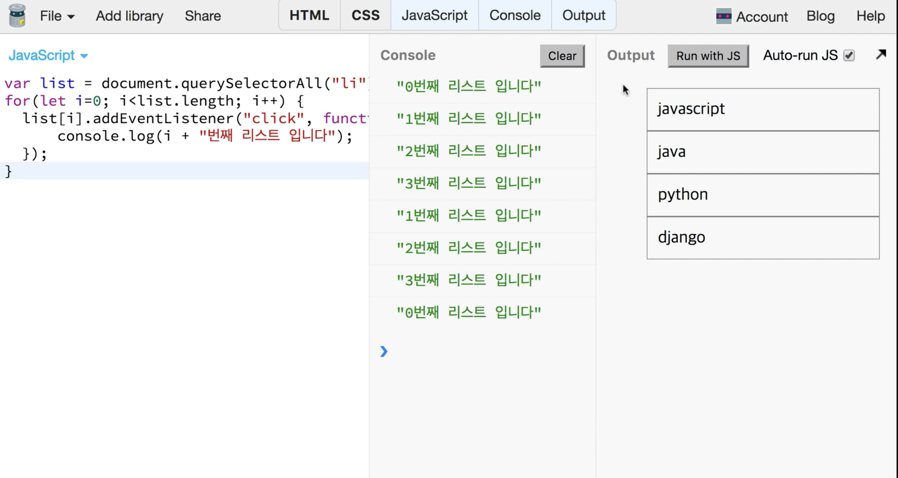

# 00. Scope

* ES6
    - 대부분의 브라우저에서 지원한다.
    - 필요 시 `바벨`을 사용하여 변경.

## 1. Scope

### let

#### Sample 1

            var name = "global var";

            function home() {
                var homevar = "homevar";
                for (var i = 0; i < 100; i++)
                {

                }
                console.log(i);
            }

            home(); // 100
#### Sample 2: Let
* Let: block scope

            var name = "global var";

            function home() {
                var homevar = "homevar";
                for (let i = 0; i < 100; i++)
                {

                }
                console.log(i);
            }

            home(); // Error

* `let i`는 for문 내에서의 block scope이기 때문에 `console.log`가 불가능.

#### Sample 3: Let
* if
            var name = "global var";

            function home() {
                var homevar = "homevar";
                for (var i = 0; i < 100; i++)
                {

                }
                if (true) {
                    let myif = "myif";
                }

                console.log(myif);
            }

            home(); // Error
* `myif`는 `if`문 내에 해당하는 scope를 갖기 때문에 에러 발생.

### let과 closure
#### html

            <!DOCTYPE html>
            <html>
            <head>
                <meta charset="UTF-8">
                <meta name="viewport" content="width=device-width, initial-scale=1.0">
                <meta http-equiv="X-UA-Compatible" content="ie=edge">
                <title>Document</title>
            </head>
            <body>
            <ul>
                <li>javascipt</li>
                <li>java</li>
                <li>python</li>
                <li>django</li>
            </ul>
            </body>
            </html>
#### JS: var

            var list = document.querySelectorAll("li");
            for (var i = 0; i < list.length; i++) {
                list[i].addEventListner("click", function(){
                    console.log(i + "번째 리스트입니다. ");
                })
            }
#### 결과

* `i` 값은 callback 밖에 있는 값을 계속 참조를 유지하며 4라는 값을 공유.
    - 지역변수를 사용해서 해결할 수도 있으나 `let`으로 해결 가능.
    - 블록에 있던 것을 기억하다가 그것을 참조하는 방식.

### const - 선언된 변수 지키기
#### sample: var

            function home() {
                var homename = 'my house';
                homename = "your house";
                console.log(homename);
            }

            home(); // "your house"

* 기존엔 변수명을 대문자로 선언하여 상수라는 것을 알려줬었다. (coding convention)
#### sample: const 

            function home() {
                const homename = 'my house';
                // homename = "your house"; // Error
                console.log(homename);
            }

            home();

* 배열의 경우 마찬가지
            function home() {
                const homename = [1, 2, 3, 3];
                homename = ["1", "2"];
                console.log(homename);
            }

            home();
* 전략
    * const를 기본으로 사용할 것.
    * 변경이 될 수 있는 변수는 let을 사용한다.
    * var은 사용하지 않는다.

### const 특성과 immutable array

            function home() {
                const list = ["apple", "orange", "watermelon"];
                // list = "sdsdf"; // error
                list.push("banana");
                console.log(list); // ["apple", "orange", "watermelonn", "banana"];
            }

            home();
* const를 사용하더라도 array와 object의 값을 변경하는 것은 가능하다.
    - 값을 재할당하는 형식의 코드만 사용 불가.
#### immutable array
* ex) 뒤로 가기, 앞으로 가기를 했을 때 글의 내용이 보존.

##### sample
            function home() {
                const list = ["apple", "orange", "watermelon"];
                list.push("banana");
                console.log(list);
            }

            const list = ["apple", "orange", "watermelon"];
            list2 = [].concat(list, "banana");
            console.log(list === list2); // false

* 불변이긴 하나, list 원본은 보존.
* 원본을 기반으로 여러 변형이 가능한 array.
* 원본을 그대로 두고 복사본을 만드는 방법
    - cf) react: state값이 바뀔 때 redux 사용 (상태값 바꿔서 반환)
    - immutable.js library
    - spread operator (ES6)

### 결론
* `const`는 재할당은 안 되나 `const`로 배열이나 object 내용을 변경하거나 삭제할 수는 있다. 