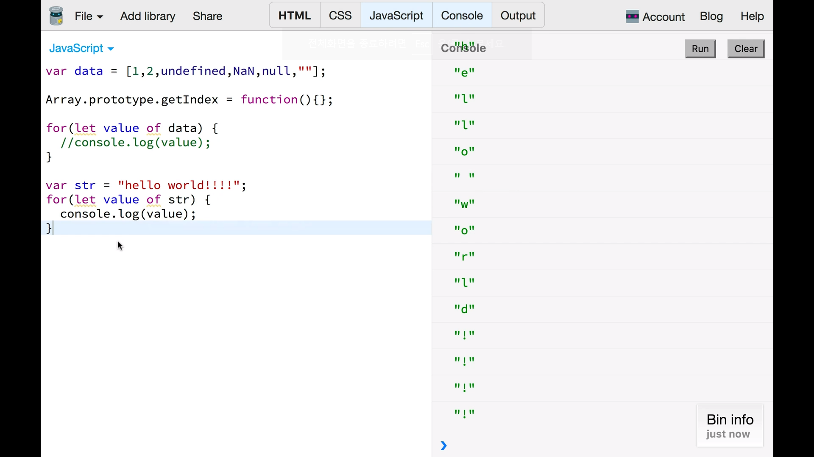

# 02. Array
* Array를 순회하며 동작하는 것들 살펴보기.

## 1. for of - 순회하기(iterate)

### basic loops
            var data = [1, 2, undefined, NaN, null, ""];

            1) for (var i = 0; i < data; i++) {
                console.log(i); // 1, 2, 3, 4, 5
            }

            2) data.forEach(function(value) {
                console.log("valueis", value); // "valueis" 1 "valueis" 2 "valueis" undefined ...
            });

            3) for (let value in data) {
                console.log(data[idx]); // 1, 2,  undefined, NaN, null, ""
            } 

### `for in`의 문제점
- `for in`은 object를 순회할 때 사용하려고 사용.
- 배열도 object의 일종이기에 순회는 함.
- __그러나 자기 자신이 갖고 있지 않은 상위의 어떤 추가된 값까지 포함할 수도 있음.__
#### 문제 상황 예시

            var data = [1, 2, undefined, NaN, null, ""];
            Array.prototype.getIndex = function(){};

            for (let idx in data) {
                console.log(data[idx]);
            }
#### 결과 

- `data` 내 요소들만 출력될 줄 알았으나 `function()`도 출력된 상황.
- object에서 자기가 갖고 있지 않은 객체 이외의 프로토타입 객체를 이용해서 상위에 추가된 객체를 나타내는 문제가 있다.
- 따라서 `for in`을 array에서 쓰면 안 된다.
    - 이와 같은 상황이 없다고 보장할 수 없으므로.

#### for of로 수정
            for (let value of data) {
                console.log(value); // 1 2 undefined NaN null ""
            }
* 정상적으로 출력됨.
* for문을 돌 때, `for in`을 썼을 때의 실수를 줄이기 위해 __`for of`__ 가 새로 나오게 되었다.

### for of의 다른 사용
* for of는 배열이 아닌, 문자열에도 사용할 수 있다.

            var str = "hello world!!!!";
            for (let value of str) {
                console.log(value); // "h" "e" "l" ....... "w" "o" "r" "l" "d" "!" "!" ...
            }
#### 결과

* 문자열을 character단위로 돌아가며 다룰 수 있다.

## 2. spread operator - 배열의 복사
* spread operater, 펼침 연산자 

            let pre = ["apple", "orange", 100];
            let newData = [...pre]; // 펼침 연산자

            console.log(pre, newData); // ["apple", "orange", 100];, ["apple", "orange", 100]; 
            console.log(pre == newData) // False
#### 결과

* 펼침 연산자는 `...`으로 표현함. 

* 그러나 출력 결과가 같더라도 같은 참조를 유지하지 않음.
    * 새로운 걸 복사해서 반환하는 것.(`=== concat`)
    * `...data`은 `...` 뒤에 있는 `data`를 펼쳐서 `가질 뿐이다.
* spread operator는 말 그대로 펼쳐서 보여주는 거다.
    - `...pre`는 `pre`를 그대로 넣은 것이다.
    - `let newData = [...pre];` === `let newData = ["apple", "orange", 100]`

## 3. spread operator - 몇 가지 활용
### 장점 1: 배열 사이에 넣을 때 유용

            let pre = [100, 200, "hello", null];
            let newData = [0, 1, 2, 3, ...pre, 4];
            console.log(newData); // 0, 1, 2, 3, 100, 200, "hello, null, 4

* 특정 인덱스에 `pre` 데이터를 그대로 넣어버렸다.
    - 배열을 특정 배열에 넣을 때 유용하다.

### 장점 2: 개별 parameter로 값을 전달하기 쉽다.
#### 기존 방식
    
            function sum(a, b, c) {
                return a + b + c;
            }

            let pre = [100, 200, 300];
- 위와 같은 코드가 있을 때, `pre`의 합을 알기 위해선 2가지 정도를 생각할 수 있었다.
    - `sum(pre[0], pre[1], pre[2])`
    - `sum.apply(null, pre));`
        - `.apply` 메소드 정보 [링크](https://www.zerocho.com/category/JavaScript/post/57433645a48729787807c3fd)

#### spread operator
- `sum(...pre)` 로 충분

#### 정리
* spread operator는 배열을 바꾸지 않고 새로 복사할 수 있는 방법이라 볼 수 있다.
* 배열을 합치거나 펼쳐진 상태로 함수의 parameter로 전달해주어야 할 때 유용하게 사용 가능.
## 4. from 메서드로 진짜 배열 만들기

### ES2015 from method

            function addMark() {
                let newData = [];

                for (let i = 0; i < arguments.length; i++) {
                    newData.push(arguments[i] + "!");
                }
                console.log(newData);
            }

            addMark(1, 2, 3, 4, 5); // ["1!", "2!", "3!", "4!", "5!"]

* javascript는 함수에 parameter가 없이 있어도, `arguments` 객체를 사용한다면, 사용할 때 argumnet를 넣어줄 수 있다.
    - 그렇게 권장되는 패턴은 아님.
    - 또한 `arguments`는 마치 배열처럼 보이지만 배열이 아님. 
        - 따라서 배열에 사용하듯 `map`을 이용하면 에러가 발생함.
        - `map()`: map() 메서드는 배열 내의 모든 요소 각각에 대하여 주어진 함수를 호출한 결과를 모아 새로운 배열을 반환합니다. [출처 및 참고](https://developer.mozilla.org/ko/docs/Web/JavaScript/Reference/Global_Objects/Array/map)

#### arguments 에러

            function addMark() {
                let newData = arguments.map(function(value) {
                    return value + "!";
                });

                console.log(newData);
            }

            addMark(1, 2, 3, 4, 5); // Error

            * Error: arguments는 배열과 비슷하게 생겼지만 배열이 아니기 때문.

* 이외에도 JS엔 배열 같지만 배열 같지 않은 것이 여러 가지 있음. 비슷한 예시가 `.querySelectorAll` 등으로 받아온 데이터가 `nodeList`인 것이 있음.

#### from method로 진짜 배열 만들기

            function addMark() {
                let newArray = Array.from(arguments);
                let newData = newArray.map(function(value) {
                    return value + "!";
                });

                console.log(newData);
            }

            addMark(1, 2, 3, 4, 5); // ["1!", "2!", "3!", "4!", "5!"]

* `Array.from`: 배열이 아닌 것을 배열형태로 만든다.
    - 예시) `queryselector`등으로 받아온 데이터에 대해서 위와 같이 사용할 수 있음.
    - Array.from() 메서드는 유사 배열 객체(array-like object)나반복 가능한 객체(iterable object)를 얕게 복사해새로운Array 객체를 만듭니다. [출처](https://developer.mozilla.org/ko/docs/Web/JavaScript/Reference/Global_Objects/Array/from)

