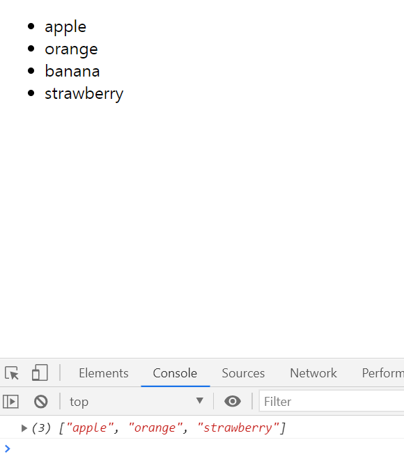

# 03. Practice 01
* 실습 예제 1

## 예제
* filter, includes, from을 사용하여 문자열 'e'가 포함된 노드로 구성된 배열을 만들어 반환하기.

## 예시

            function print() {

            }

            print();
## 작성

### 작성한 코드
            function print() {
                const ul = document.querySelector("ul");
                const li = Array.from(ul.querySelectorAll("li"));
                let arr = [];
                let answers = [];
                li.forEach(function(query) {
                    arr.push(query.innerText);
                })
                answers = arr.filter(answer => answer.includes('e'));
                console.log(answers);
                /*
                answers = arr.filter(function(answer) {
                    if(answer.includes('e'))
                        return answer});
                */
            }

            print();

### 결과 화면

### 풀이
* li의 목록을 받기 위해 querySelector를 활용하였다.
* querySelector로 받은 목록은 진짜 배열은 아니므로, `Array.from`을 통해 array로 변환해준다.
* 이후 `forEach`를 사용해 각 요소의 `text` 값들을 받고, `push`를 이용해 `arr`에 넣어준다.
* 답안이 될 값들은 요소의 `text` 값 중, 특정 값이 포함된 것이므로, `.filter`를 사용한다.
    - 특정 단어가 포함된 걸 받아야 하기에, `includes`를 이용해 걸러준다.

### 참고 링크
* [Array.prototype.includes()](https://developer.mozilla.org/ko/docs/Web/JavaScript/Reference/Global_Objects/Array/includes)
* [Array.prototype.forEach()](https://developer.mozilla.org/ko/docs/Web/JavaScript/Reference/Global_Objects/Array/forEach)
* [Array.prototype.filter()](https://developer.mozilla.org/ko/docs/Web/JavaScript/Reference/Global_Objects/Array/filter)
* [자바스크립트의 유용한 배열 메소드 사용하기... map(), filter(), find(), reduce()](https://bblog.tistory.com/300)
    - `filter` 참고
* [[Javascript] map, reduce, filter를 유용하게 활용하는 15가지 방법](https://medium.com/@Dongmin_Jang/javascript-15%EA%B0%80%EC%A7%80-%EC%9C%A0%EC%9A%A9%ED%95%9C-map-reduce-filter-bfbc74f0debd)
* [화살표 함수](https://developer.mozilla.org/ko/docs/Web/JavaScript/Reference/Functions/%EC%95%A0%EB%A1%9C%EC%9A%B0_%ED%8E%91%EC%85%98)
* [Array.prototype.forEach()](https://developer.mozilla.org/ko/docs/Web/JavaScript/Reference/Global_Objects/Array/forEach)