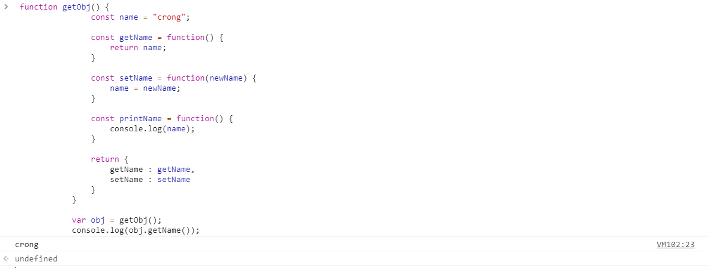
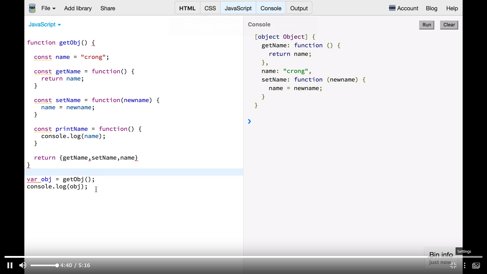
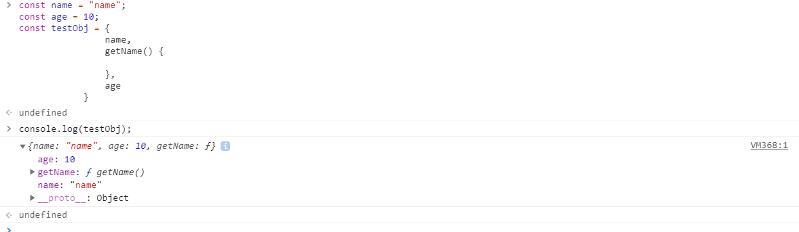

# 05. Object
* 이전의 object 선언보다 발전된 방법.

## 1. 간단히 객체 생성하기
### 예시

            const name = "crong";
            const age = 33;

            const obj = {
                name : name,
                age : age
            }

            console.log(obj); 
### function 예시
* 이전까지 사용하던 방식

            function getObj() {
                const name = "crong";

                const getName = function() {
                    return name;
                }

                const setName = function(newName) {
                    name = newName;
                }

                const printName = function() {
                    console.log(name);
                }

                return {
                    getName : getName,
                    setName : setName
                }
            }

            var obj = getObj();
            console.log(obj.getName());
#### 결과

* `return` 문 내에서 볼 수 있듯, key-value 값이 같은데도 표시를 해주었어야 했음.

### ES6
#### 같은 예시를 다르게 표현 가능
* 그러나 ES6 이후, 위와 같은 경우는 생략하여 아래와 같이 동작 가능.
    - `return {getName, setName}`
* key 값으로 object를 쉽게 사용할 수 있음.

#### 객체를 쉽게 생성할 수 있음

            const data = {
                name,
                getName() {
                    
                }, 
                age
            }
* 위와 같이 선언하여도, key-value 설정 가능.
##### 결과

* 변수 `name`, `age`의 값이 정해져 있자, key 에 대한 value를 따를 넣어주지 않아도 알아서 들어간 모습.
* 메소드(함수)도 자동으로 선언되어 사용할 수 있다.