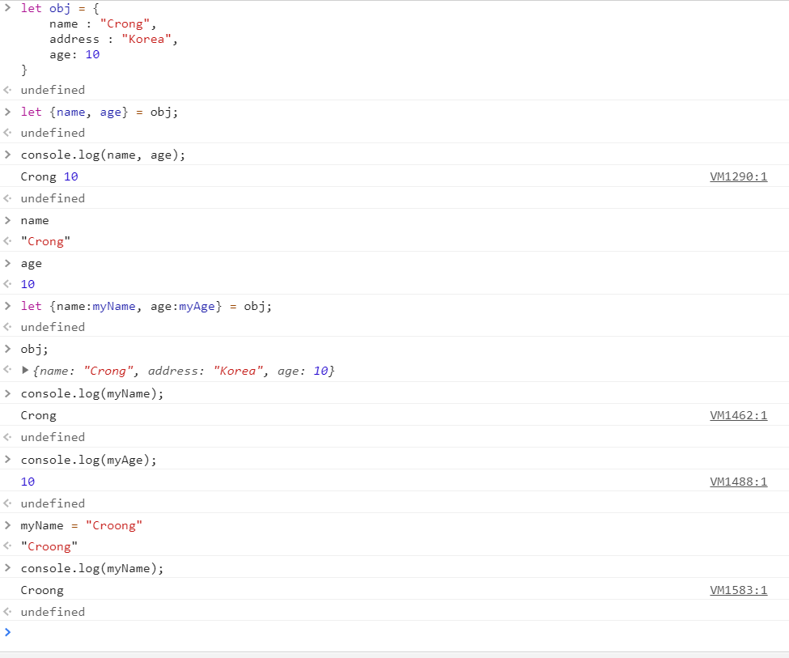
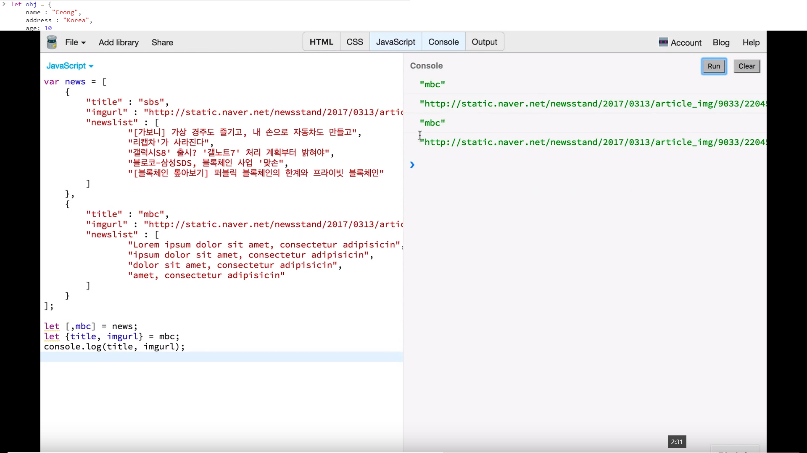
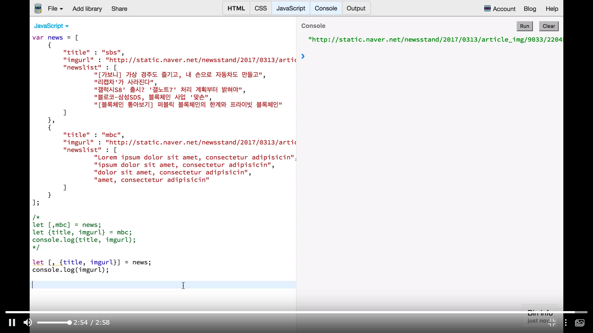
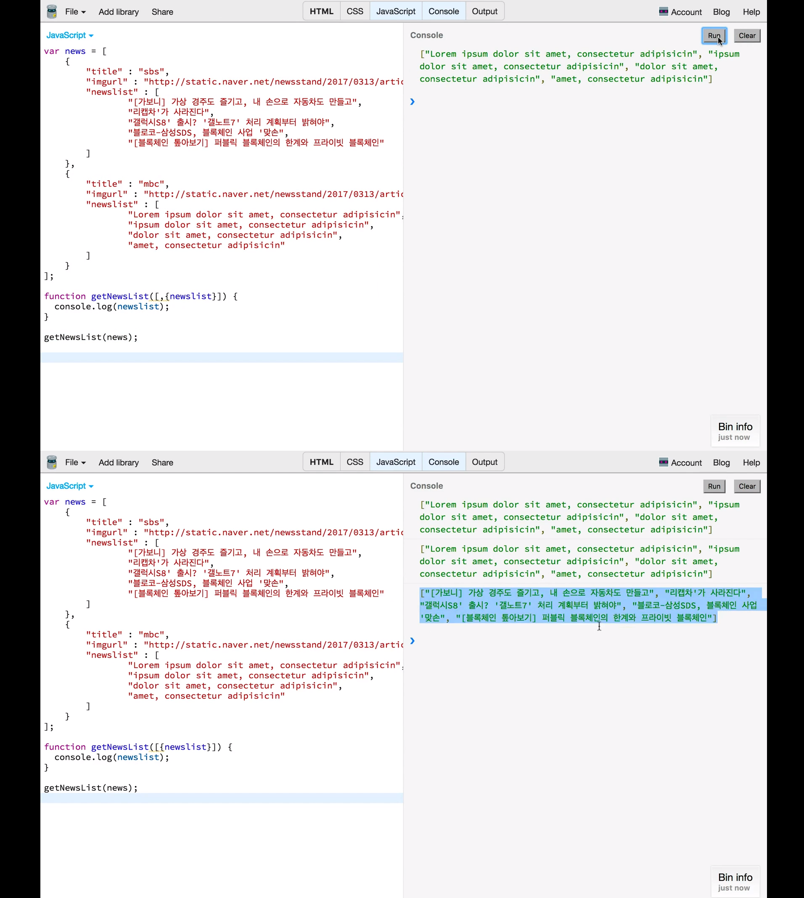
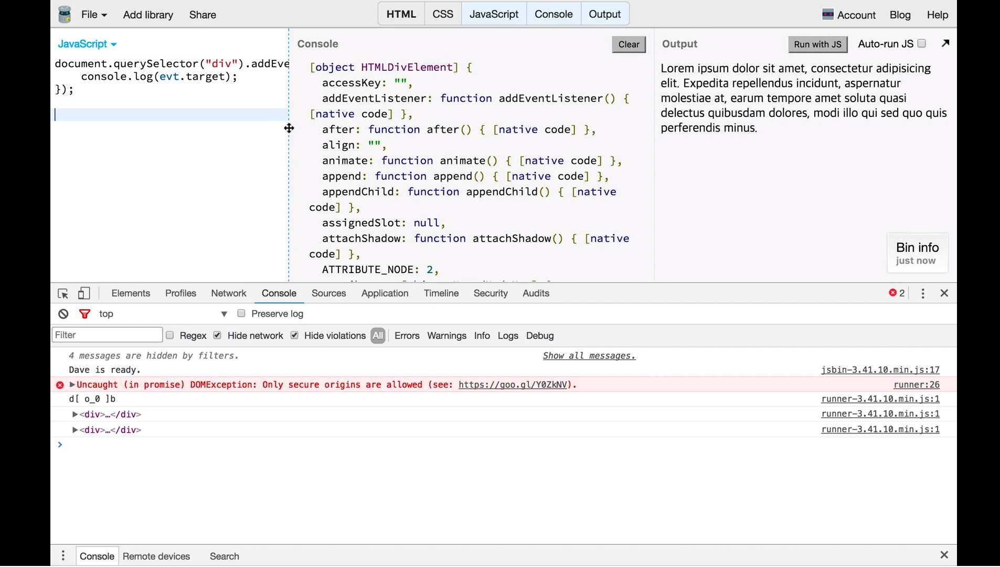
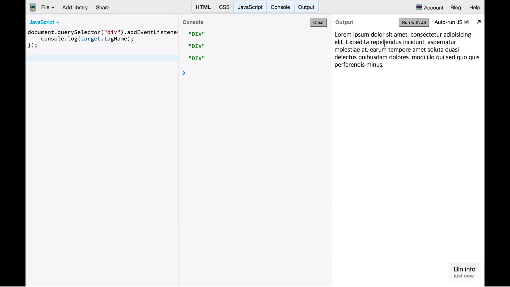

# 06. Destructuring

## 1. Destructuring Array
* ES6 중 꽤 유용한 기능

### 기존 사용법

            let data = ["crong", "honux", "jk", "jinny"]
            let jisu = data[0];
            let jung = data[2];

* 특정 인덱스의 값에 접근하여 쓰기.

### ES6
            let data = ["crong", "honux", "jk", "jinny"]
            let [jisu,,jung] = data;
            console.log(jisu, jung); // crong, jk

* data의 값에 접근하되, `,`로 구분하여서 각 변수에 인덱스에 해당하는 값이 담김.

## 2. Destructuring Object
* 배열 말고도 object에서도 막강한 기능

            let obj = {
                name: "crong",
                address : "Korea",
                age : 10
            }

            let {name, age} = obj;
            console.log(name, age);

            let {name:myName, age:myAge} = obj;
            console.log(myName, myAge);
### 실습

* `let obj = { }`
    -  객체 obj 선언
* `let {name, age} = obj;`
    - destructuring을 이용하여 새로운 변수인 `name`과 `age`에 obj의 value를 반영함.
    - 따라서 `name`, `age`의 값은 `crong`, `10`임. (`console.log()`)
* `let {name:myName, age:myAge} = obj;`
    - destructuring을 이용하여 새로운 변수인 `myName`과 `myAge`를 만들고, 이를 `obj`의 key인 `name`과 `age`의 value로 초기화함.
    - 따라서 `myName`과 `myAge`엔 obj의 `name`과 `age` 값이 할당됨. 
* 참조 관계는 아님. 따라서 `myName`에 새로운 값을 대입해도 객체엔 영향이 없음.

#### 결론
* Destructuring을 활용하여 object의 value를 다른 변수에 담아줄 수 있다.
## 3. Destructuring 활용: JSON 파싱
* JSON 데이터에 대한 파싱

### 개선 방법
* 위와 같은 방법
    - array의 두 번째 요소를 선택하고, JSON 데이터의 `title`, `imgurl`만 가져오는 방법을 취하면 필요한 key값만 취할 수 있다.

## 4. Destructuring 활용: Event 객체 전달
### function 활용해보기
- parameter에도 줄 수 있다.

* 함수 작성을, 받는 parameter에 `,`를 통해 원하는 newlist만 들어오도록 조정하여 이용한 예시.

### event
* `div` 태그를 하나 생성.
* 아래와 같이 eventhandler 작성

            document.querySelector("div").addEventListener("click", function(evt) {
                console.log(evt.target);
            });

* 결과

* 위 경우는 event object 전체를 받은 것임.
#### Desturucturing 활용

            document.querySelector("div").addEventListener("click", function({target}) {
                console.log(target.tagName);
            });
* 받은 event object의 전체를 넘기는 게 아니라, target만 받은 것임.

* 결과

#### 다른 활용
            document.querySelector("div").addEventListener("click", function({type, target}) {
                console.log(type, target.tagName);
            });
### 결론
* 기존엔 모두 parsing하는 등의 작업이 필요했으나 지금은 위와 같은 방법으로 비교적 쉽게 같은 작업을 해줄 수 있다.