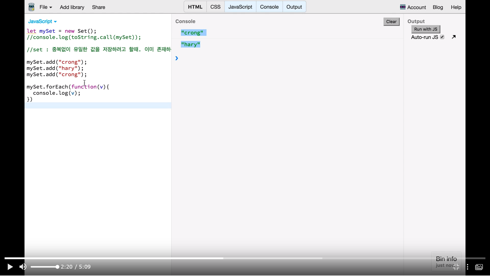
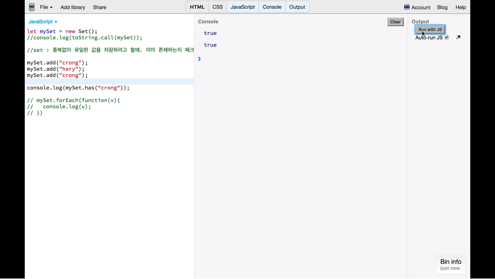
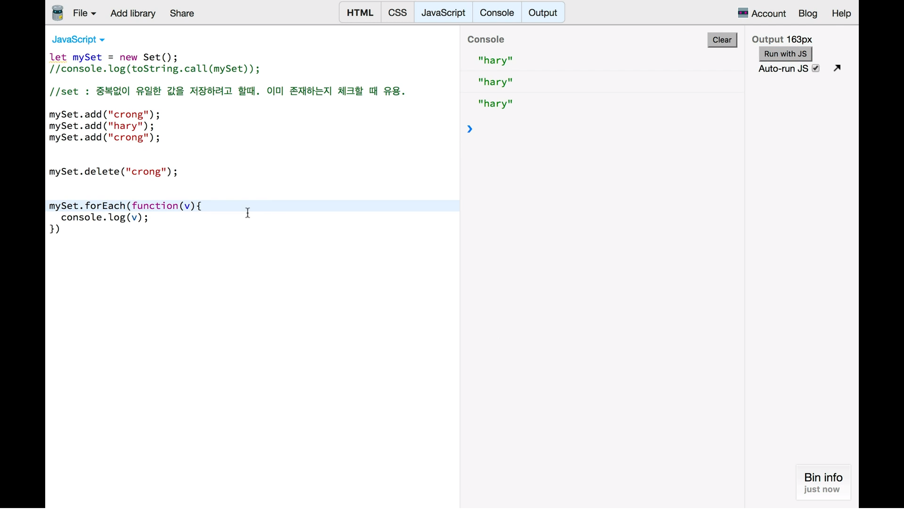
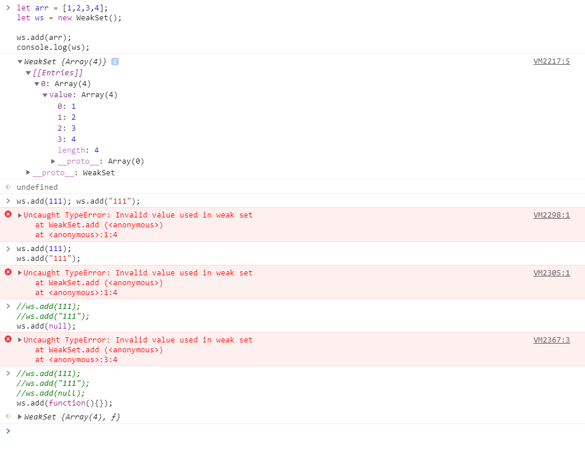
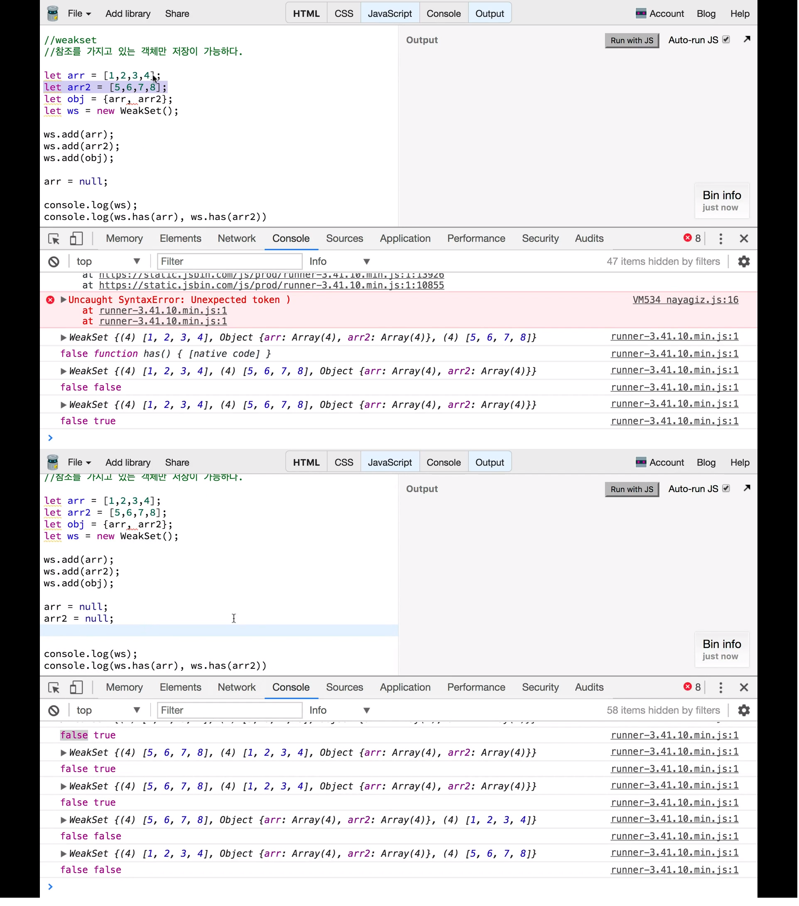

# 07. Set & WeakSet

## 1. Set 으로 유니크한 배열만들기
* Set은 일종의 자료구조.
* 중복 없이 유일한 값을 저장하려고 할 때, 이미 존재하는지 체크할 때 유용하다.

### 출력 예시

* 중복된 값은 중복 출력해주지 않음.
* `add` 했음에도 추가되지 않은 것.

### 조건문 활용

* set도 배열과 유사.
* `indexOf` 등으로 확인할 수도 있지만, `set`은 비교적 간단함.

### delete

## 2. WeakSet 으로 효과적으로 객체 타입 저장하기
* set: 중복없이 유일한 값만 저장. 모든 타입 가능
* weakset: 참조를 갖고 있는 객체만 저장이 가능하다.

### 참조를 갖고 있는 객체만 저장이 가능하다?

* 객체가 아닌 `111`, `"111"`, `null`은 추가가 되지 않음
* 일종의 객체인 `function`은 추가됨.

#### 의미
* 객체가 null로 되거나 필요가 없어지면 garbage collection 대상이 됨.
* 따라서 weakSet에서도 그 정보가 자동으로 없어지게 됨.
    - 참조를 모니터링한다고 생각할 수 있음.
### 예시 2
* 객체 형태를 중복 없이 저장하려고 할 때 유용하다.

* 예시의 윗 부분을 보면, weakset `ws`에 담긴 `arr`만 `null`이다.
    - 이에 자료를 갖고 있는지 확인하는 `has` 명령어를 통해 살펴보면, `arr`은 `false`가 출력된다.
* 아래 부분에선 둘 다 `null`인 경우에 `false`로 나타나는 것을 보여준다.

