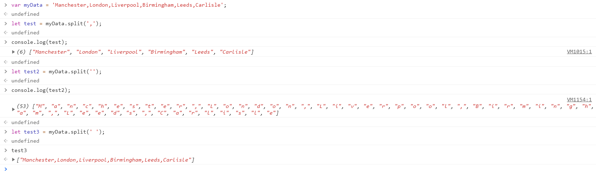
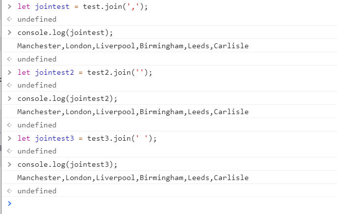
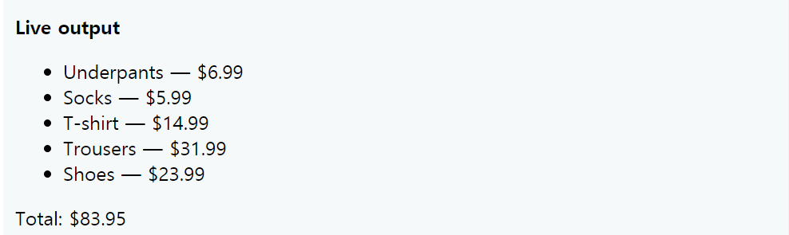

# 07. Arrays
* [원문 링크](https://developer.mozilla.org/ko/docs/Learn/JavaScript/First_steps/Arrays)

* 목표: 배열이 무엇인지 이해를 하고 JavaScript에서 어떻게 다룰 수 있는지 배운다.
## 학습 내용

* 배열은 하나의 목록에 여러 값을 저장하는 하나의 객체, 'list-like' 객체로 표현된다. 
    - 배열 객체는 변수를 저장할 수 있고, 리스트 내부에 따로 존재하는 서로 다른 타입의 자료에도 접근할 수 있다. 
    0 또한 loop와 같이 동시에 각 자료에 같은 동작을 해주어야 할 때 효과적이다.
### 배열 만들기
* `let arr1 = [1, 2, 3];`
* `let arr2 = [1, 2, 3, [1, 2]]; // 2차원 배열`
* 등등

### 여러 메소드
#### `.length`
- 길이를 반환한다.
- 예시)
            let arr = [1, 2];
            console.log(arr.length) // 2

#### 문자열을 배열로, 배열을 문자열로 변환하기
* `.split`
    - 구분자를 기준으로 문자열을 배열로 만든다.
    - 예시
    
    - `,`를 구분자로 사용한 `test`
    - `''`를 구분자로 사용한 `test2`
        - 이 경우, 각 단어(바이트) 단위로 끊겨 저장된다.
    - ` `를 구분자로 사용한 `test3`
* `join`
    - `split`의 정반대 기능.
    - 구분자를 기준으로 배열 각 원소를 붙여 하나의 문자열로 만든다.
    - 예시
    
* `toString`
    - 매개변수가 없는 `join()`
    - 예시

            var dogNames = ['Rocket','Flash','Bella','Slugger'];
            dogNames.toString(); //Rocket,Flash,Bella,Slugger
#### 배열에 item을 추가하고 제거하기
* 맨 끝
    - `push()`: 추가하기
    - `pop()`: 제거하기
* 맨 앞
    - `unshift()`: 추가하기
    - `shift()` : 제거하기
* 위 두 메소드는 `const 상수` 에도 적용 가능하다.
    - 예시

            const arr = [];

            arr.push(1);
            console.log(arr); // [1]
            arr.pop();
            console.log(arr); // []
            arr.unshift(4);
            console.log(arr); //[4]
            arr.shift();
            console.log(arr); // []
## 예제 1
* 아래와 같은 화면을 만들기.

### 예시
            var list = document.querySelector('.output ul');
            var totalBox = document.querySelector('.output p');
            var total = 0;
            list.innerHTML = '';
            totalBox.textContent = '';
            // number 1
                            'Underpants:6.99'
                            'Socks:5.99'
                            'T-shirt:14.99'
                            'Trousers:31.99'
                            'Shoes:23.99';

            for (var i = 0; i <= 0; i++) { // number 2
            // number 3

            // number 4
            
            // number 5
            itemText = 0;
            
            var listItem = document.createElement('li');
            listItem.textContent = itemText;
            list.appendChild(listItem);
            }

            totalBox.textContent = 'Total: $' + total.toFixed(2);

### 풀이
* [작성 답안](./srcs\07_Arrays\prac1.js)
* 옷의 종류와 가격을 하나의 배열에 담았다.
* 이 배열의 각 원소는 문자열인데, 데이터를 parsing하기 위해 split을 이용하여 가격과 이름 부분을 따로 저장한다.
* 형식에 맞게 텍스트에 더해준다.

## 예제 2

* input 칸에 입력하고 search를 누르면 검색한 내역이 차례대로 조회되는 기능 구현.
* 과거의 내역은 아래로 내려가고, 5개가 넘어갈 시, 먼저 입력저 순서대로 사라짐.

### 예시
            var list = document.querySelector('.output ul');
            var searchInput = document.querySelector('.output input');
            var searchBtn = document.querySelector('.output button');

            list.innerHTML = '';

            var myHistory = [];

            searchBtn.onclick = function() {
                // we will only allow a term to be entered if the search input isn't empty
                if (searchInput.value !== '') {
                    // number 1

                    // empty the list so that we don't display duplicate entries
                    // the display is regenerated every time a search term is entered.
                    list.innerHTML = '';

                    // loop through the array, and display all the search terms in the list
                    for (var i = 0; i < myHistory.length; i++) {
                        itemText = myHistory[i];
                        var listItem = document.createElement('li');
                        listItem.textContent = itemText;
                        list.appendChild(listItem);
                    }

                    // If the array length is 5 or more, remove the oldest search term
                    if (myHistory.length >= 5) {
                    // number 2

                    }

                    // empty the search input and focus it, ready for the next term to be entered
                    searchInput.value = '';
                    searchInput.focus();
                }
            }
### 풀이

          
* 배열의 맨 앞에 값이 추가되가도록 `unshift` 구현, 초과되는 범위의 원소는 `pop`으로 빼냄.